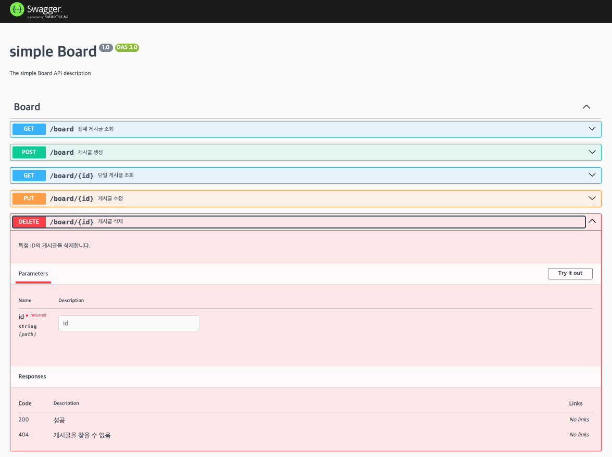

# NestJS Notice Board Project

## 프로젝트 구조

```
nestjs-notice/
├── src/
│   ├── board/               # 게시판 모듈
│   │   ├── board.controller.ts
│   │   ├── board.service.ts
│   │   ├── board.module.ts
│   │   └── dto/               # DTO 정의
│   ├── common/              # 공통 모듈 (logger, filters, decorators 등)
│   ├── app.module.ts
│   └── main.ts
├── test/jest/               # 테스트
├── package.json
└── tsconfig.json
```

## 시작하기

### NestJS CLI 설치 (처음 1회)

```bash
pnpm add -g @nestjs/cli
```

### 의존성 설치

```bash
pnpm install
```

### 개발 서버 실행

```bash
pnpm start:dev
```

---

## API 문서 (Swagger)

서버 실행 후 브라우저에서 API 문서를 확인하고 직접 테스트해볼 수 있습니다.

각 API에 대한 상세 설명과 요청/응답 스키마는 Swagger 페이지에 자세히 명시되어 있습니다.

[http://localhost:3000/api](http://localhost:3000/api)



---

## API 테스트 (RestClient)

Postman 대신 VSCode의 [REST Client](https://marketplace.visualstudio.com/items?itemName=humao.rest-client) 확장 프로그램을 사용하여 API를 테스트합니다.
프로젝트 루트의 `.http` 파일을 통해 API 요청을 관리하고 실행할 수 있습니다.


---

## 향후 개선 방향

- **데이터베이스 연동**
  - TypeORM + PostgreSQL 적용
  - Entity/관계/마이그레이션/시딩 기능 추가
- **인증 기능 확장**
  - JWT + Passport 기반 회원가입/로그인
  - Refresh Token 전략
  - Guard 활용한 권한 제어
- **배포 & 운영**
  - pm2를 이용한 프로세스 관리
  - 유닛 테스트 & e2e 테스트 적용
- **심화 기능**
  - Custom Decorator, Provider, Dynamic Module
  - Advanced Auth (슬라이딩 세션, 메타데이터 기반 인가)
  - Interceptor/미들웨어를 이용한 로깅 및 응답 매핑
  - DB 성능 최적화 (Transaction, Index, 쿼리 분석)
  - 보안 (Rate limiting, Sentry, Health check)
  - CQRS 적용
  - 파일 업로드, Task 스케줄링 기능
  - CI/CD (GitHub Actions, 프로덕션 인프라)

---

<p align="center">
  <a href="http://nestjs.com/" target="blank"></a>
</p>

[circleci-image]: https://img.shields.io/circleci/build/github/nestjs/nest/master?token=abc123def456
[circleci-url]: https://circleci.com/gh/nestjs/nest

  <p align="center">A progressive <a href="http://nodejs.org" target="_blank">Node.js</a> framework for building efficient and scalable server-side applications.</p>
    <p align="center">
<a href="https://www.npmjs.com/~nestjscore" target="_blank"></a>
<a href="https://www.npmjs.com/~nestjscore" target="_blank"></a>
<a href="https://www.npmjs.com/~nestjscore" target="_blank"></a>
<a href="https://circleci.com/gh/nestjs/nest" target="_blank"></a>
<a href="https://discord.gg/G7Qnnhy" target="_blank"></a>
<a href="https://opencollective.com/nest#backer" target="_blank"></a>
<a href="https://opencollective.com/nest#sponsor" target="_blank"></a>
  <a href="https://paypal.me/kamilmysliwiec" target="_blank"></a>
    <a href="https://opencollective.com/nest#sponsor"  target="_blank"></a>
  <a href="https://twitter.com/nestframework" target="_blank"></a>
</p>
  <!--[](https://opencollective.com/nest#backer)
  [](https://opencollective.com/nest#sponsor)-->

## Description

[Nest](https://github.com/nestjs/nest) framework TypeScript starter repository.

## Installation

```bash
$ pnpm install
```

## Running the app

```bash
# development
$ pnpm run start

# watch mode
$ pnpm run start:dev

# production mode
$ pnpm run start:prod
```

## Test

```bash
# unit tests
$ pnpm run test

# e2e tests
$ pnpm run test:e2e

# test coverage
$ pnpm run test:cov
```

## Support

Nest is an MIT-licensed open source project. It can grow thanks to the sponsors and support by the amazing backers. If you'd like to join them, please [read more here](https://docs.nestjs.com/support).

## Stay in touch

- Author - [Kamil Myśliwiec](https://kamilmysliwiec.com)
- Website - [https://nestjs.com](https://nestjs.com/)
- Twitter - [@nestframework](https://twitter.com/nestframework)

## License

Nest is [MIT licensed](LICENSE).
