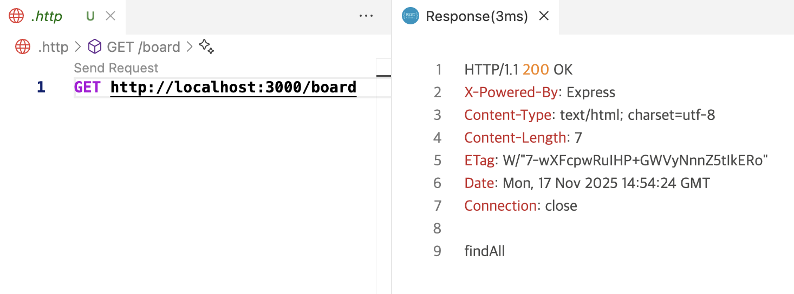

# NestJS Board API

**NestJS 기반 게시판 API 프로젝트**  
NestJS의 기본 구조와 개념(Module, Controller, Service, DI 등)을 학습하고,  
CRUD 게시판 API를 구현하며 실무에서 자주 사용하는 기능들을 적용한 토이 프로젝트입니다.

---

## 주요 기능

- 게시글 CRUD (생성, 조회, 수정, 삭제)
- DTO를 통한 데이터 유효성 검증 (Validation)
- Custom Decorator 활용
- 예외 처리 (Exception Filters)
- 로깅 처리 (Logger Module)
- 환경 변수 관리 (Config Module)
- Swagger를 이용한 API 문서화

---

## 기술 스택

- **Framework**: NestJS (Node.js 기반)
- **Language**: TypeScript
- **Database**: PostgreSQL / MySQL / MongoDB / Supabase / Firebase Firestore ( 중 선택 예정 nosql써보고 싶음)
- **ORM / SDK**: TypeORM / Prisma / Firebase SDK 등
- **Docs**: Swagger

---

## 프로젝트 구조 (예시)

````bash
nestjs-board/
├── src/
│   ├── boards/              # 게시판 모듈
│   │   ├── boards.controller.ts
│   │   ├── boards.service.ts
│   │   ├── boards.module.ts
│   │   ├── dto/             # DTO 정의
│   │   └── entities/        # 엔티티 정의
│   ├── common/              # 공통 모듈 (logger, filters, decorators 등)
│   ├── app.module.ts
│   └── main.ts
├── test/
├── package.json
└── tsconfig.json


# NestJS CLI 설치 (처음 1회)
pnpm add -g @nestjs/cli

# 의존성 설치
pnpm install

# 개발 서버 실행
pnpm start:dev


---

## API 문서 (Swagger)

서버 실행 후 브라우저에서 확인:

[http://localhost:3000/api](http://localhost:3000/api)

---

## API 테스트 (RestClient)

Postman 대신 VSCode의 [REST Client](https://marketplace.visualstudio.com/items?itemName=humao.rest-client) 확장 프로그램을 사용하여 API를 테스트합니다.
프로젝트 루트의 `.http` 파일을 통해 API 요청을 관리하고 실행할 수 있습니다.



---

---

## 향후 개선 방향
- **데이터베이스 연동**
  - TypeORM + PostgreSQL 적용
  - Entity/관계/마이그레이션/시딩 기능 추가
- **인증 기능 확장**
  - JWT + Passport 기반 회원가입/로그인
  - Refresh Token 전략
  - Guard 활용한 권한 제어
- **배포 & 운영**
  - pm2를 이용한 프로세스 관리
  - 유닛 테스트 & e2e 테스트 적용
- **심화 기능**
  - Custom Decorator, Provider, Dynamic Module
  - Advanced Auth (슬라이딩 세션, 메타데이터 기반 인가)
  - Interceptor/미들웨어를 이용한 로깅 및 응답 매핑
  - DB 성능 최적화 (Transaction, Index, 쿼리 분석)
  - 보안 (Rate limiting, Sentry, Health check)
  - CQRS 적용
  - 파일 업로드, Task 스케줄링 기능
  - CI/CD (GitHub Actions, 프로덕션 인프라)

---


<p align="center">
  <a href="http://nestjs.com/" target="blank"></a>
</p>

[circleci-image]: https://img.shields.io/circleci/build/github/nestjs/nest/master?token=abc123def456
[circleci-url]: https://circleci.com/gh/nestjs/nest

  <p align="center">A progressive <a href="http://nodejs.org" target="_blank">Node.js</a> framework for building efficient and scalable server-side applications.</p>
    <p align="center">
<a href="https://www.npmjs.com/~nestjscore" target="_blank"></a>
<a href="https://www.npmjs.com/~nestjscore" target="_blank"></a>
<a href="https://www.npmjs.com/~nestjscore" target="_blank"></a>
<a href="https://circleci.com/gh/nestjs/nest" target="_blank"></a>
<a href="https://discord.gg/G7Qnnhy" target="_blank"></a>
<a href="https://opencollective.com/nest#backer" target="_blank"></a>
<a href="https://opencollective.com/nest#sponsor" target="_blank"></a>
  <a href="https://paypal.me/kamilmysliwiec" target="_blank"></a>
    <a href="https://opencollective.com/nest#sponsor"  target="_blank"></a>
  <a href="https://twitter.com/nestframework" target="_blank"></a>
</p>
  <!--[](https://opencollective.com/nest#backer)
  [](https://opencollective.com/nest#sponsor)-->

## Description

[Nest](https://github.com/nestjs/nest) framework TypeScript starter repository.

## Project setup

```bash
$ pnpm install
````

## Compile and run the project

```bash
# development
$ pnpm run start

# watch mode
$ pnpm run start:dev

# production mode
$ pnpm run start:prod
```

## Run tests

```bash
# unit tests
$ pnpm run test

# e2e tests
$ pnpm run test:e2e

# test coverage
$ pnpm run test:cov
```

## Deployment

When you're ready to deploy your NestJS application to production, there are some key steps you can take to ensure it runs as efficiently as possible. Check out the [deployment documentation](https://docs.nestjs.com/deployment) for more information.

If you are looking for a cloud-based platform to deploy your NestJS application, check out [Mau](https://mau.nestjs.com), our official platform for deploying NestJS applications on AWS. Mau makes deployment straightforward and fast, requiring just a few simple steps:

```bash
$ pnpm install -g @nestjs/mau
$ mau deploy
```

With Mau, you can deploy your application in just a few clicks, allowing you to focus on building features rather than managing infrastructure.

## Resources

Check out a few resources that may come in handy when working with NestJS:

- Visit the [NestJS Documentation](https://docs.nestjs.com) to learn more about the framework.
- For questions and support, please visit our [Discord channel](https://discord.gg/G7Qnnhy).
- To dive deeper and get more hands-on experience, check out our official video [courses](https://courses.nestjs.com/).
- Deploy your application to AWS with the help of [NestJS Mau](https://mau.nestjs.com) in just a few clicks.
- Visualize your application graph and interact with the NestJS application in real-time using [NestJS Devtools](https://devtools.nestjs.com).
- Need help with your project (part-time to full-time)? Check out our official [enterprise support](https://enterprise.nestjs.com).
- To stay in the loop and get updates, follow us on [X](https://x.com/nestframework) and [LinkedIn](https://linkedin.com/company/nestjs).
- Looking for a job, or have a job to offer? Check out our official [Jobs board](https://jobs.nestjs.com).

## Support

Nest is an MIT-licensed open source project. It can grow thanks to the sponsors and support by the amazing backers. If you'd like to join them, please [read more here](https://docs.nestjs.com/support).

## Stay in touch

- Author - [Kamil Myśliwiec](https://twitter.com/kammysliwiec)
- Website - [https://nestjs.com](https://nestjs.com/)
- Twitter - [@nestframework](https://twitter.com/nestframework)

## License

Nest is [MIT licensed](https://github.com/nestjs/nest/blob/master/LICENSE).
